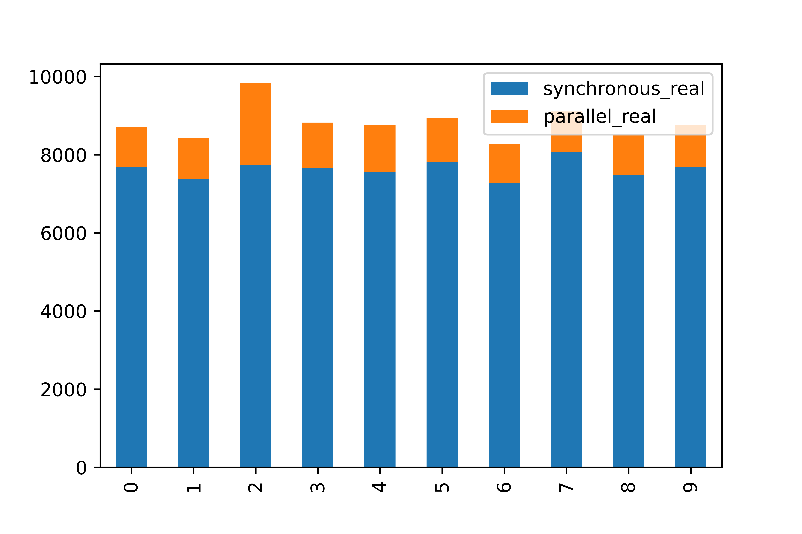

# Experiment Synopsis

Running a job/task over multiple locations/directories
in-serial vs in-parallel mode

## Job setup

update all git repositories by running a `git pull` in all of them

```
find ./* -maxdepth 0 -type d -print -exec git -C {} pull \;
```

NOTE: use GNU parallel and not the one provided by moreutils

```
find ./* -maxdepth 0 -type d -print | parallel git -C {} pull
```

## Run Experiment

```
./run-experiment.sh 2>&1 | tee exp.data
```

## Data

## Results



## Conclusion

Parallel execution is **6X** faster than serial execution on WSL windows
